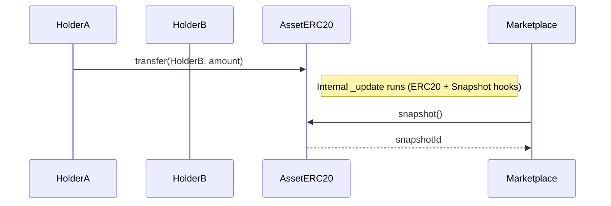
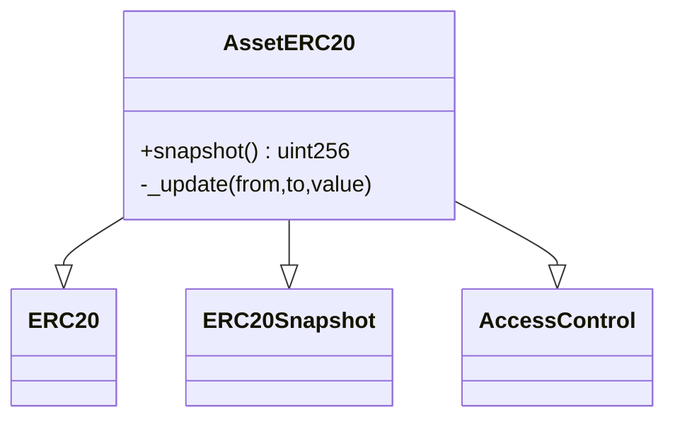

# AssetERC20

## Purpose
Each registered asset is represented by its own ERC-20 token contract. The full supply represents 100% ownership. Tokens can be transferred or subdivided freely.

## Key Concepts
- **Snapshot**: Allows freezing balances at a block to support revenue distribution.
- **AccessControl**: Roles manage minting and snapshot-taking.

## Functions
- `constructor(name, symbol, assetId, admin, initialOwner, totalSupply)`  
  Deploys the ERC-20, mints total supply to the initial owner.

- `snapshot()`  
  Takes a snapshot of balances and returns a snapshotId.

- `_update(from, to, value)` (override)  
  Internal function ensuring both ERC20 and ERC20Snapshot logic run when transfers occur.

## Workflow
1. ERC-20 supply is minted to the initial owner at asset registration.
2. Owners transfer tokens for fractional ownership.
3. Marketplace uses `snapshot()` when revenue distribution is required.

---

## Diagrams

### Transfers & Snapshot (sequence)

### Inheritance (class)

