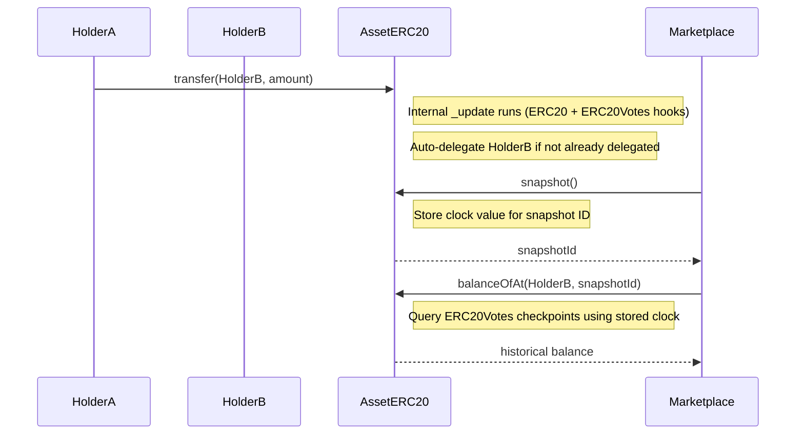
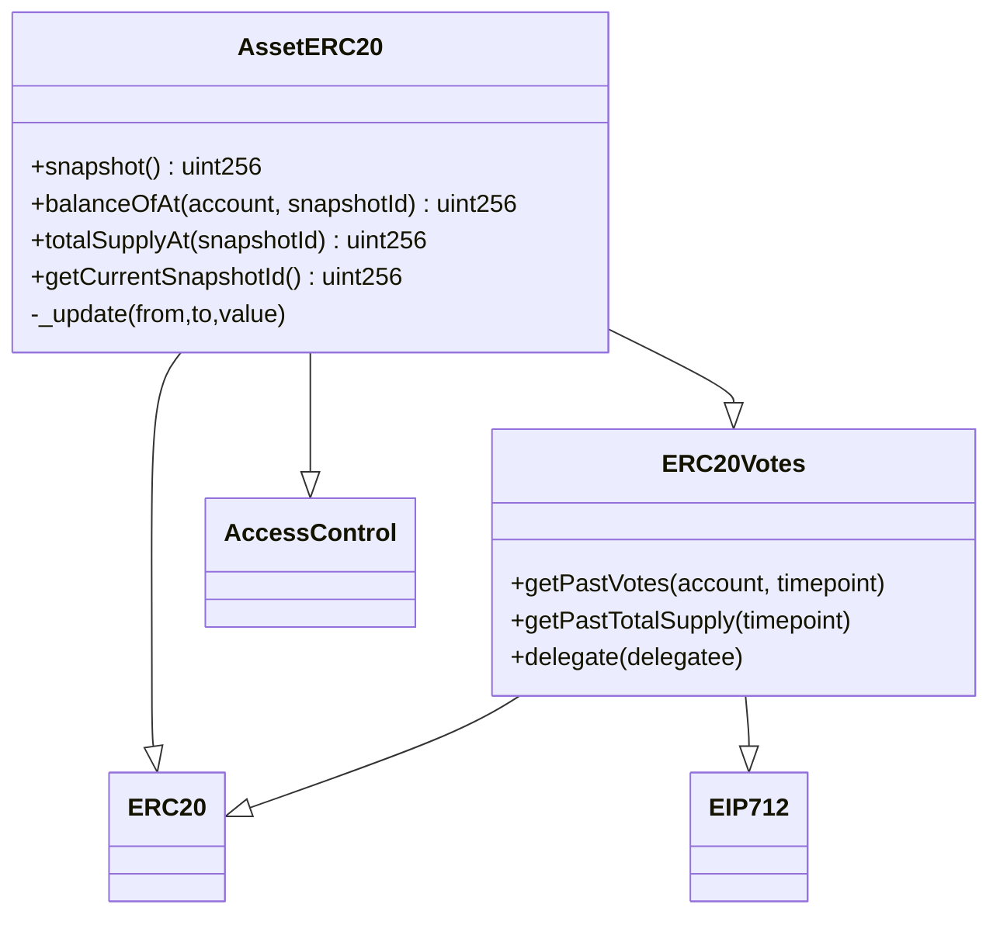

# AssetERC20

## Purpose
Each registered asset is represented by its own ERC-20 token contract. The full supply represents 100% ownership. Tokens can be transferred or subdivided freely.

## Key Concepts
- **ERC20Votes Integration**: Uses OpenZeppelin's ERC20Votes for efficient balance tracking and governance readiness
- **Custom Snapshot System**: Clock-based snapshot mechanism that captures balances at specific points for revenue distribution
- **Auto-Delegation**: New token holders are automatically delegated to themselves for seamless voting power tracking
- **AccessControl**: Roles manage minting and snapshot-taking

## Functions
- `constructor(name, symbol, assetId, admin, initialOwner, totalSupply)`
  Deploys the ERC-20, mints total supply to the initial owner with EIP712 initialization and auto-delegation.

- `snapshot()`
  Takes a snapshot of balances using the custom clock-based system and returns a snapshotId.

- `balanceOfAt(account, snapshotId)`
  Returns the token balance of an account at a specific snapshot using ERC20Votes historical data.

- `totalSupplyAt(snapshotId)`
  Returns the total supply at a specific snapshot using ERC20Votes historical data.

- `getCurrentSnapshotId()`
  Returns the current snapshot ID counter.

- `_update(from, to, value)` (override)
  Internal function ensuring both ERC20 and ERC20Votes logic run when transfers occur, plus auto-delegation for new token holders.

## Workflow
1. ERC-20 supply is minted to the initial owner at asset registration with auto-delegation.
2. Owners transfer tokens for fractional ownership, with recipients auto-delegated.
3. Marketplace uses `snapshot()` when revenue distribution is required, leveraging ERC20Votes checkpoints.
4. Revenue claims use `balanceOfAt()` and `totalSupplyAt()` for historical balance queries.

---

## Diagrams

### Transfers & Snapshot (sequence)

### Inheritance (class)

