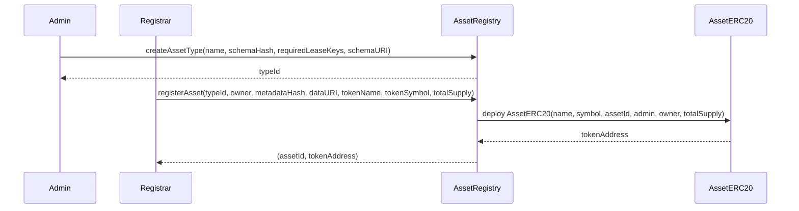
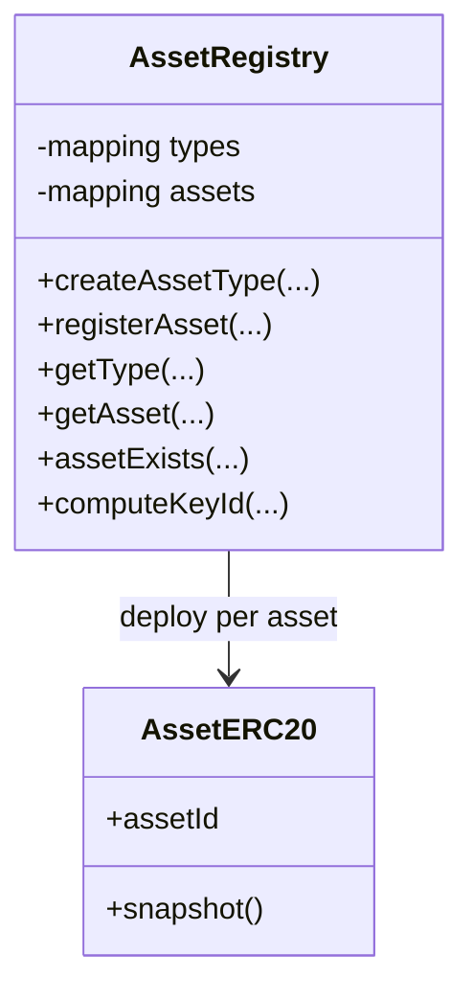

# AssetRegistry

## Purpose
The AssetRegistry is the central contract for defining asset types and registering concrete assets. Each asset is represented by its own ERC-20 token contract, which enables fractional ownership and transfer.

## Key Concepts
- **AssetType**: Defines the schema and required lease keys for a category of assets (e.g., Satellite, Space Station).
- **Asset**: A specific instance of an asset type with metadata and a deployed ERC-20 token.

## Functions
- `createAssetType(name, schemaHash, requiredLeaseKeys, schemaURI)`  
  Creates a new type of asset anchored by a schema hash. Returns a typeId.

- `registerAsset(typeId, owner, metadataHash, dataURI, tokenName, tokenSymbol, totalSupply)`  
  Registers an asset instance, deploys its ERC-20, and mints the full supply to the initial owner.

- `getType(typeId)` / `getAsset(assetId)` / `assetExists(assetId)`  
  View functions to read registered types and assets.

- `computeKeyId(string key)`  
  Utility function to compute field key IDs (keccak256 of field name).

## Workflow
1. An admin calls `createAssetType` with a canonical JSON schema hash.
2. A registrar calls `registerAsset` to register a new asset and deploy its ERC-20 token.
3. Ownership fractions are represented as ERC-20 units that can be freely transferred.

---

## Diagrams

### Asset Type & Asset Registration (sequence)

### Registry Relations (class)

