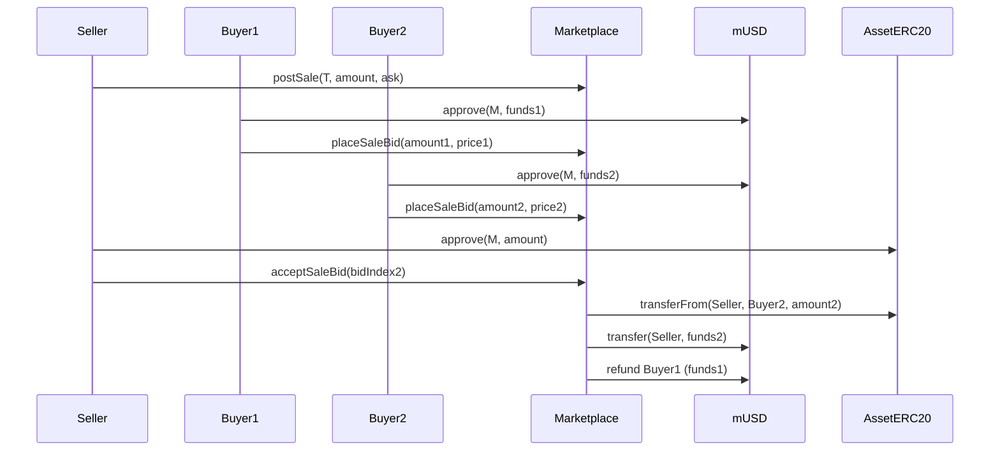
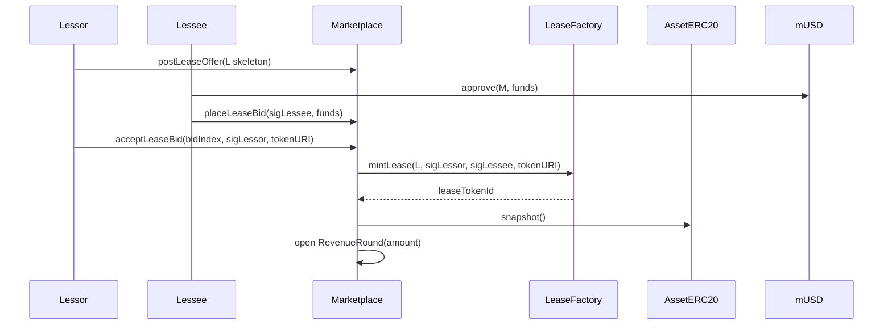
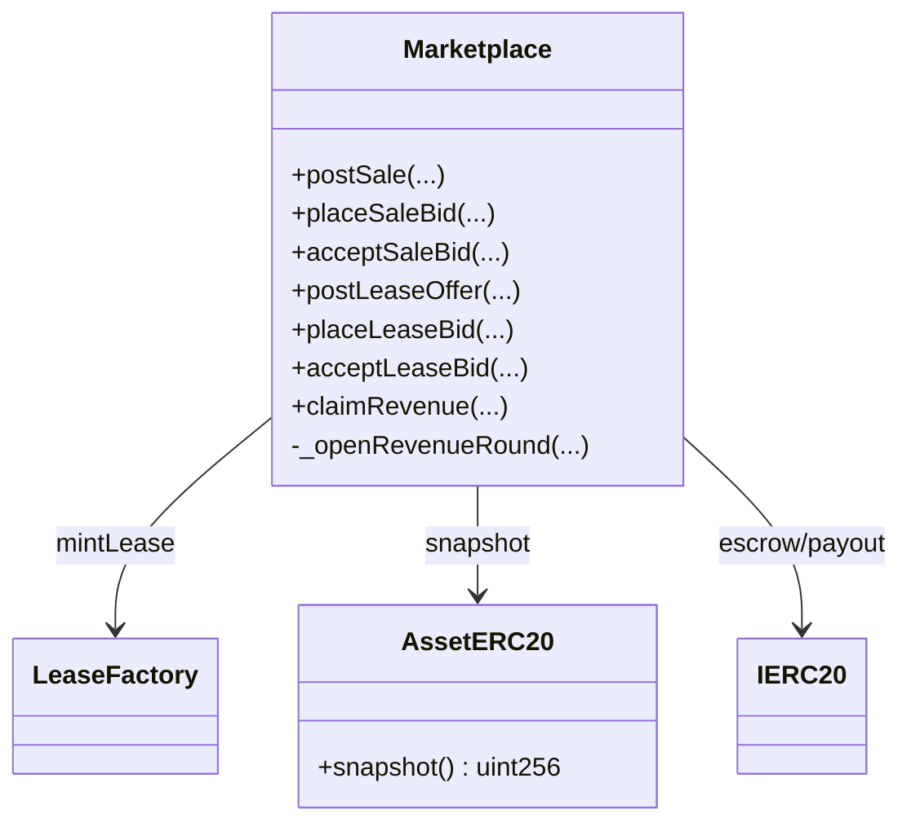

# Marketplace

## Purpose
The Marketplace handles trading of asset ERC-20 tokens (whole or fractions) and lease agreements. It also manages escrow, refunds, and revenue distribution.

## Key Concepts
- **Sales**: Sellers list asset tokens, buyers place fully funded bids, sellers accept one bid.
- **Leases**: Lessors post lease offers, lessees place funded bids, and acceptance mints a Lease NFT.
- **Revenue Rounds**: Lease income is distributed to token holders pro-rata using snapshots.

## Functions
### Sales
- `postSale(assetToken, amount, askPricePerUnit)`  
  Posts a new sale.

- `placeSaleBid(saleId, amount, pricePerUnit)`  
  Places a funded bid on a sale.

- `acceptSaleBid(saleId, bidIndex)`  
  Transfers tokens, pays seller, and refunds all other bidders.

### Leases
- `postLeaseOffer(LeaseIntent)`  
  Posts a lease offer (intent skeleton).

- `placeLeaseBid(offerId, sigLessee, funds)`  
  Places a funded lease bid with a signature.

- `acceptLeaseBid(offerId, bidIndex, sigLessor, tokenURI)`  
  Accepts one bid, mints Lease NFT, distributes funds, refunds others.

### Revenue
- `claimRevenue(roundId)`  
  Lets token holders claim their share of lease revenue.

## Workflow
1. For sales, bids are escrowed in stablecoin; on acceptance, the winner is paid and losers refunded.
2. For leases, bids are escrowed with signatures; acceptance mints Lease NFT and opens a revenue round.
3. Token holders claim revenue shares according to snapshot balances.

---

## Diagrams

### Sale Flow (sequence)

### Lease Offer & Revenue Round (sequence)

### Marketplace Structures (class)

