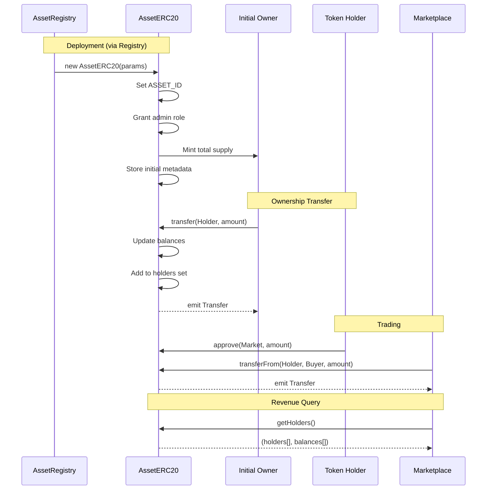
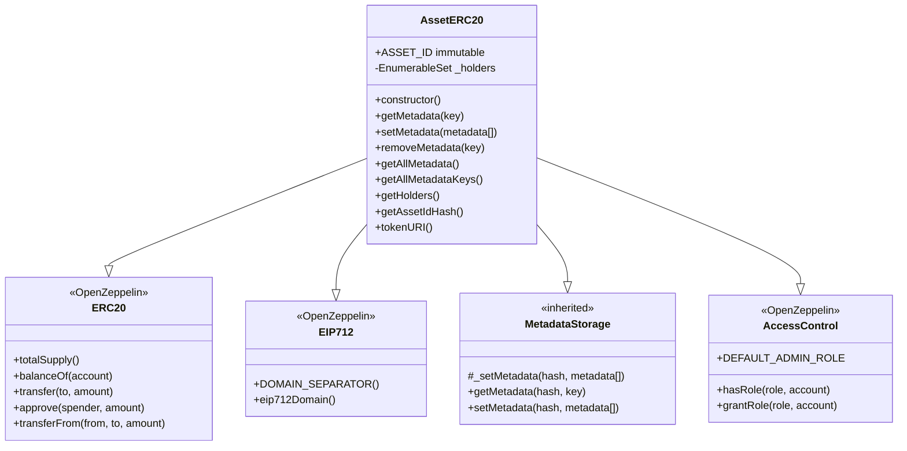

# AssetERC20

## Overview
AssetERC20 is an ERC-20 token contract representing fractional ownership of a registered asset. Each asset in the protocol has its own dedicated AssetERC20 instance, where the total supply represents 100% ownership. The contract extends standard ERC-20 with metadata storage capabilities and holder tracking for efficient revenue distribution.

## Key Features
- **Standard ERC-20**: Full compatibility with wallets, DEXes, and DeFi protocols
- **Fractional ownership**: Token balance represents percentage ownership of the underlying asset
- **Metadata inheritance**: Leverages MetadataStorage for flexible asset-specific metadata
- **Holder enumeration**: Tracks all token holders for revenue distribution
- **Factory deployment**: Created exclusively by AssetRegistry during asset registration
- **Immutable asset binding**: Permanently linked to a specific asset ID in the registry
- **EIP-712 support**: Enables gasless transactions via permits and meta-transactions

## Architecture
AssetERC20 contracts are deployed by the AssetRegistry as part of asset registration. Each instance:
- Represents ownership of exactly one registered asset
- Has a fixed total supply set at deployment
- Inherits MetadataStorage for key-value metadata management
- Uses asset ID hash as the metadata namespace
- Provides simplified metadata interfaces that abstract the hash parameter

## Upgradeability & Deployment

### UUPS Proxy Pattern
This contract uses the **UUPS (Universal Upgradeable Proxy Standard)** pattern via OpenZeppelin's upgradeable contracts. The contract inherits from `BaseUpgradable` which provides:

- **ERC-1967 Proxy**: Transparent proxy with implementation stored in standardized slot
- **Initializer Pattern**: Constructor logic moved to `initialize()` function
- **Upgrade Authorization**: Only `UPGRADER_ROLE` can authorize upgrades
- **Storage Safety**: Maintains storage layout across upgrades

### Deployment Process

**Important**: AssetERC20 is a token IMPLEMENTATION contract used by the AssetRegistry factory pattern. Each registered asset gets its own proxy instance pointing to a shared AssetERC20 implementation.

**Step 1: Deploy Implementation (Once)**
```solidity
// Deploy the AssetERC20 implementation contract (shared by all assets)
AssetERC20 implementation = new AssetERC20();
```

**Step 2: Deploy Proxy via AssetRegistry**
```solidity
// AssetRegistry deploys a new proxy for each registered asset
// This happens automatically during asset registration
bytes memory initData = abi.encodeWithSelector(
    AssetERC20.initialize.selector,
    name,               // Token name (e.g., "Satellite XYZ-1")
    symbol,             // Token symbol (e.g., "SAT-XYZ1")
    totalSupply,        // Fixed total supply
    assetId,            // Unique asset identifier
    admin,              // Address receiving DEFAULT_ADMIN_ROLE
    tokenRecipient,     // Initial recipient of all tokens
    metadata            // Initial metadata array
);
ERC1967Proxy proxy = new ERC1967Proxy(
    address(implementation),
    initData
);
```

**Step 3: Interact via Proxy**
```solidity
// All interactions go through the asset-specific proxy address
AssetERC20 assetToken = AssetERC20(address(proxy));
```

### Upgrade Process

**Only addresses with `UPGRADER_ROLE` can upgrade:**

```solidity
// Deploy new implementation
AssetERC20V2 newImplementation = new AssetERC20V2();

// Upgrade via proxy (calls _authorizeUpgrade internally)
AssetERC20(proxyAddress).upgradeToAndCall(
    address(newImplementation),
    ""  // Optional initialization data
);
```

### View Current Implementation
```solidity
function getUupsImplementation() external view returns (address)
```
Returns the current implementation address for this proxy.

### Upgrade Safety Notes
1. ⚠️ **Storage Layout**: Never reorder, remove, or change types of existing storage variables
2. ⚠️ **Initializers**: New versions must use `reinitializer(2)` if adding initialization logic
3. ⚠️ **Constructor Banned**: Implementation contracts must NOT use constructors
4. ✅ **Testing**: Always test upgrades on testnet before mainnet

## Core Functions

### Constructor
```solidity
constructor(
    string memory name,
    string memory symbol,
    uint256 totalSupply,
    uint256 assetId,
    address admin,
    address tokenRecipient,
    Metadata[] memory metadata
)
```
Deployed by AssetRegistry. Mints the entire supply to tokenRecipient, grants admin role, and sets initial metadata using the internal `_setMetadata` function to bypass access control during construction.

### Metadata Functions (Simplified Interface)

```solidity
function getMetadata(string calldata key) external view returns (string memory value)
```
Gets metadata for this asset using its ID hash as namespace.

```solidity
function setMetadata(Metadata[] calldata metadata_) external onlyRole(DEFAULT_ADMIN_ROLE)
```
Sets multiple metadata entries for this asset.

```solidity
function removeMetadata(string calldata key) external onlyRole(DEFAULT_ADMIN_ROLE)
```
Removes a metadata key for this asset.

```solidity
function getAllMetadata() external view returns (Metadata[] memory metadata)
```
Returns all metadata key-value pairs for this asset.

```solidity
function getAllMetadataKeys() external view returns (string[] memory keys)
```
Returns all metadata keys that have been set for this asset.

### Utility Functions

```solidity
function getAssetIdHash() public view returns (bytes32 hash)
```
Returns the keccak256 hash of the asset ID used as the metadata namespace.

```solidity
function tokenURI() public view returns (string memory)
```
Returns the token URI from metadata if set, empty string otherwise.

```solidity
function getHolders() external view returns (address[] memory holders, uint256[] memory balances)
```
Returns arrays of all token holders and their respective balances. Used by Marketplace for revenue distribution calculations.

### Upgradeability Functions

```solidity
function getUupsImplementation() external view returns (address)
```
Returns the address of the current implementation contract for this proxy.

## Access Control
- **DEFAULT_ADMIN_ROLE**: Can modify metadata and perform administrative functions
- **UPGRADER_ROLE**: Can authorize contract upgrades via `upgradeToAndCall()`
- **Initial admin**: Set by AssetRegistry during deployment (typically the registry owner)
- **No minting**: Total supply is fixed at deployment, no additional minting allowed

## Events
Inherits standard ERC-20 events:
- `Transfer(address indexed from, address indexed to, uint256 value)`
- `Approval(address indexed owner, address indexed spender, uint256 value)`

Plus MetadataStorage events:
- `MetadataUpdated(bytes32 indexed hash, string key, string value)`
- `MetadataRemoved(bytes32 indexed hash, string key)`

## Usage Examples

### Token Transfers
```solidity
// Standard ERC-20 transfers for fractional ownership
AssetERC20 satelliteToken = AssetERC20(tokenAddress);

// Transfer 10% ownership
uint256 tenPercent = satelliteToken.totalSupply() / 10;
satelliteToken.transfer(buyer, tenPercent);

// Approve marketplace for trading
satelliteToken.approve(marketplace, amount);
```

### Metadata Management
```solidity
// Admin updates asset metadata
Metadata[] memory updates = new Metadata[](2);
updates[0] = Metadata("status", "operational");
updates[1] = Metadata("lastMaintenance", "2024-03-15");

assetToken.setMetadata(updates);

// Query specific metadata
string memory status = assetToken.getMetadata("status");
```

### Revenue Distribution Integration
```solidity
// Marketplace uses holder enumeration for revenue sharing
(address[] memory holders, uint256[] memory balances) = assetToken.getHolders();
uint256 totalSupply = assetToken.totalSupply();

for (uint256 i = 0; i < holders.length; i++) {
    uint256 share = (revenue * balances[i]) / totalSupply;
    // Distribute share to holders[i]
}
```

## Integration Notes
- **Deployment only via registry**: Cannot be deployed independently, ensuring all tokens are registered
- **Fixed supply model**: No inflation or deflation, maintaining clear ownership percentages
- **Metadata namespace**: Uses `keccak256(abi.encodePacked(ASSET_ID))` for isolation
- **Holder tracking**: Critical for Marketplace revenue distribution functionality
- **Standard compliance**: Full ERC-20 compatibility for ecosystem integration

## Security Considerations
- **Immutable asset binding**: ASSET_ID is immutable, preventing token migration attacks
- **Access control inheritance**: Admin role management through OpenZeppelin's AccessControl
- **No mint/burn after deployment**: Prevents supply manipulation and maintains ownership integrity
- **Metadata validation**: Admin-only updates prevent unauthorized information changes
- **Constructor access pattern**: Uses `_setMetadata` internally to handle factory deployment scenario

---

## Diagrams

### Token Lifecycle


### Contract Structure


### Metadata Flow
```mermaid
graph LR
    subgraph "AssetERC20 Instance"
        AID[ASSET_ID = 42]
        Hash[Hash = keccak256<42>]
        Meta[Metadata Storage]

        AID --> Hash
        Hash --> Meta
    end

    subgraph "Metadata Operations"
        Set[setMetadata<metadata[]>]
        Get[getMetadata<key>]
        Remove[removeMetadata<key>]

        Set --> Meta
        Get --> Meta
        Remove --> Meta
    end

    subgraph "Simplified Interface"
        User[User/Admin]
        User --> Set
        User --> Get
        User --> Remove
    end
```