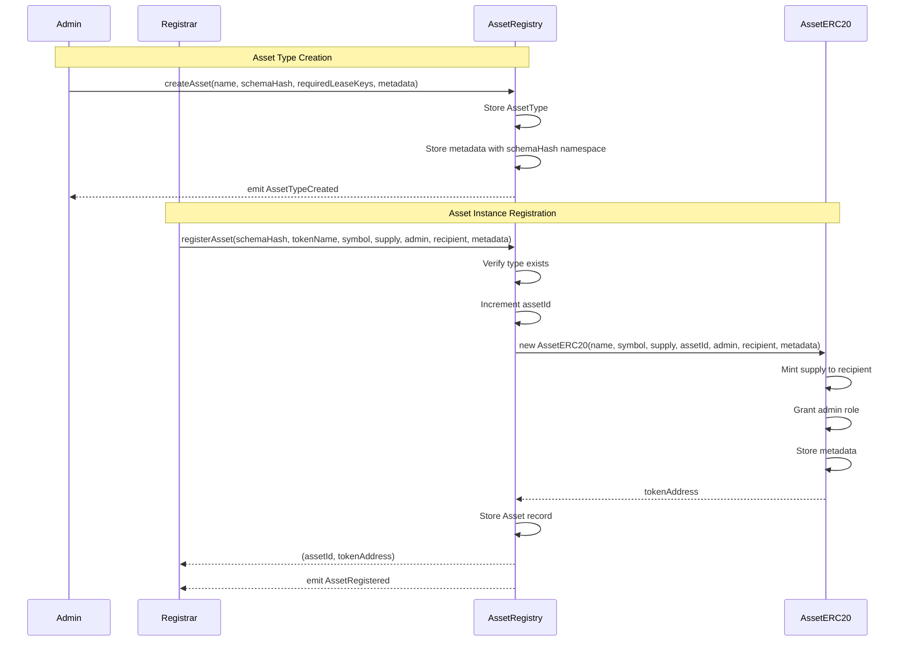
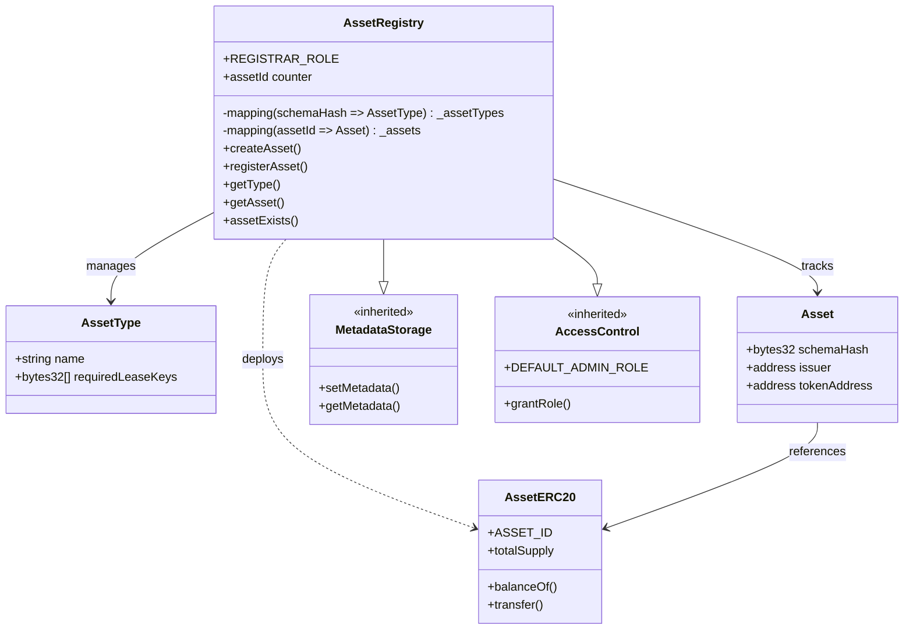
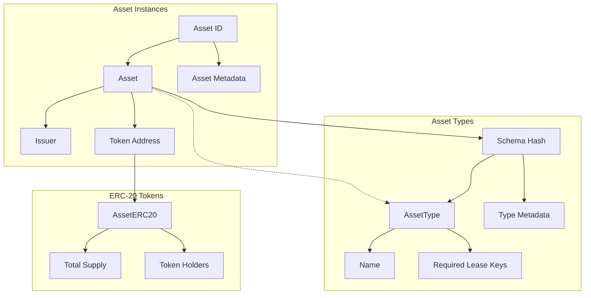

# AssetRegistry

## Overview
The AssetRegistry is the central contract for defining asset types and registering concrete asset instances. It serves as both a schema registry for asset types and a factory for deploying per-asset ERC-20 tokens. The contract maintains a canonical registry of all assets in the protocol, enabling fractional ownership through tokenization.

## Key Features
- **Asset type management**: Define reusable asset schemas with required lease metadata keys
- **Asset instance registry**: Track all registered assets with their deployed token contracts
- **ERC-20 factory pattern**: Automatically deploys a new AssetERC20 contract for each registered asset
- **Metadata inheritance**: Leverages MetadataStorage for flexible schema and asset metadata
- **Role-based access**: Separate admin and registrar roles for governance
- **On-chain schema anchoring**: Uses content-addressed hashes for immutable schema references

## Architecture
The AssetRegistry acts as the authoritative source for:
- Asset type definitions (schemas) that establish categories like "Satellite" or "Space Station"
- Registered asset instances with their associated ERC-20 token contracts
- Metadata storage for both types and instances via inherited MetadataStorage
- Integration point for LeaseFactory and Marketplace contracts to verify asset existence

## Core Functions

### Asset Type Management

```solidity
function createAsset(
    string calldata name,
    bytes32 schemaHash,
    bytes32[] calldata requiredLeaseKeys,
    Metadata[] calldata metadata
) external onlyRole(DEFAULT_ADMIN_ROLE)
```
Creates a new asset type definition. The schemaHash serves as a unique identifier and content-addressed reference to the canonical JSON Schema stored off-chain (e.g., IPFS). Metadata typically includes the schemaURI for retrieval.

### Asset Registration

```solidity
function registerAsset(
    bytes32 schemaHash,
    string calldata tokenName,
    string calldata tokenSymbol,
    uint256 totalSupply,
    address admin,
    address tokenRecipient,
    Metadata[] calldata metadata
) external onlyRole(REGISTRAR_ROLE) returns (uint256 newAssetId, address tokenAddress)
```
Registers a new asset instance and deploys its ERC-20 token contract. The total supply represents 100% ownership, initially minted to the tokenRecipient. The admin receives DEFAULT_ADMIN_ROLE on the deployed token.

### View Functions

```solidity
function getType(bytes32 schemaHash) external view returns (AssetType memory)
```
Returns the asset type definition for a given schema hash.

```solidity
function getAsset(uint256 id) external view returns (Asset memory)
```
Returns the registered asset details including schema hash, issuer, and token address.

```solidity
function assetExists(uint256 id) external view returns (bool)
```
Checks if an asset ID has been registered (has a deployed token contract).

```solidity
function tokenURI(bytes32 schemaHash) public view returns (string memory)
```
Retrieves the token URI from metadata if set for the asset type.

## Access Control
- **DEFAULT_ADMIN_ROLE**: Can create asset types and manage metadata
- **REGISTRAR_ROLE**: Can register new asset instances and deploy tokens
- **Role separation**: Enables decentralized asset registration while maintaining type governance

## Events

```solidity
event AssetTypeCreated(string indexed name, bytes32 indexed schemaHash, bytes32[] requiredLeaseKeys)
```
Emitted when a new asset type is defined.

```solidity
event AssetRegistered(uint256 indexed assetId, bytes32 indexed schemaHash, address tokenAddress)
```
Emitted when an asset instance is registered and its token deployed.

## Usage Examples

### Creating an Asset Type
```solidity
// Admin defines a new "Satellite" asset type
bytes32 schemaHash = keccak256(abi.encodePacked(satelliteSchema));
bytes32[] memory leaseKeys = new bytes32[](2);
leaseKeys[0] = keccak256("orbitParameters");
leaseKeys[1] = keccak256("communicationBands");

Metadata[] memory metadata = new Metadata[](1);
metadata[0] = Metadata("schemaURI", "ipfs://QmSatelliteSchema...");

registry.createAsset("Satellite", schemaHash, leaseKeys, metadata);
```

### Registering an Asset Instance
```solidity
// Registrar registers a specific satellite
Metadata[] memory assetMeta = new Metadata[](3);
assetMeta[0] = Metadata("manufacturer", "SpaceX");
assetMeta[1] = Metadata("launchDate", "2024-01-15");
assetMeta[2] = Metadata("dataURI", "ipfs://QmSatelliteData...");

(uint256 assetId, address tokenAddress) = registry.registerAsset(
    schemaHash,
    "Starlink-42",        // token name
    "STAR42",            // token symbol
    1000000 * 10**18,    // 1M tokens (100% ownership)
    admin,               // token admin
    initialOwner,        // receives all tokens
    assetMeta
);
```

### Integration with Other Contracts
```solidity
// LeaseFactory verifies asset existence
require(REGISTRY.assetExists(leaseIntent.assetId), "asset !exists");

// Marketplace retrieves token address
Asset memory asset = registry.getAsset(assetId);
IERC20 token = IERC20(asset.tokenAddress);
```

## Integration Notes
- **Schema immutability**: Once created, asset types cannot be modified (schema hash is the key)
- **Token deployment**: Each asset gets its own AssetERC20 with independent supply and governance
- **Metadata flexibility**: Both types and instances can store arbitrary metadata via inheritance
- **Cross-contract verification**: LeaseFactory and Marketplace rely on the registry for asset validation
- **Factory pattern**: Registry acts as the sole deployer of AssetERC20 contracts

## Security Considerations
- **Schema anchoring**: Content-addressed hashes ensure schema integrity and prevent tampering
- **Role-based deployment**: Only registrars can deploy new assets, preventing spam
- **Immutable references**: Asset token addresses cannot be changed after deployment
- **Supply protection**: Total supply is set at deployment and managed by the AssetERC20 contract
- **Metadata access**: Admin-only metadata updates prevent unauthorized modifications

---

## Diagrams

### Asset Registration Flow


### Contract Relationships


### Data Model
