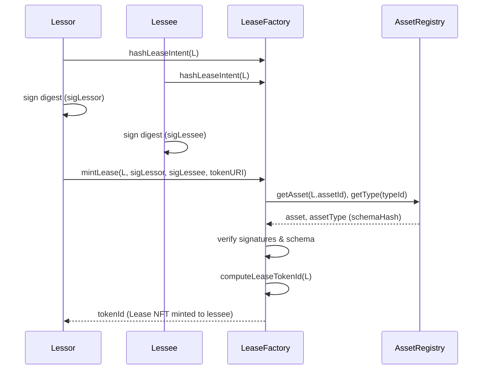
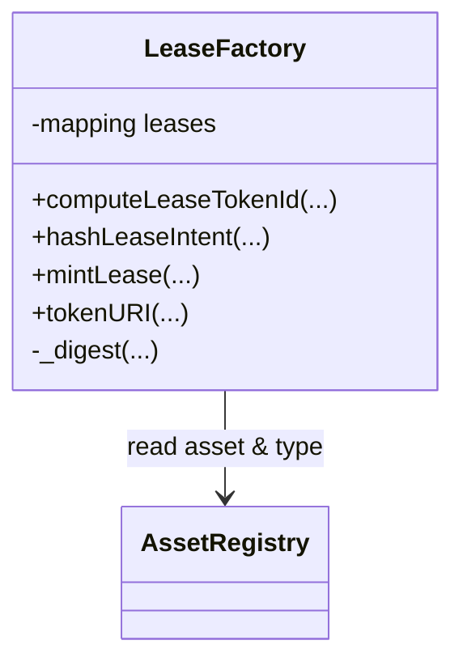

# LeaseFactory

## Purpose

The LeaseFactory creates Lease NFTs (ERC-721) that record lease agreements between lessors and lessees. Each lease NFT is minted only when both parties sign the same lease intent.

## Key Concepts

- **LeaseIntent**: EIP-712 struct signed by both lessor and lessee, containing terms of the lease.
- **LeaseData**: On-chain storage of essential lease details.

## Functions

- `computeLeaseTokenId(LeaseIntent)`  
  Deterministically computes a lease NFT id from intent fields.

- `hashLeaseIntent(LeaseIntent)`  
  Returns the EIP-712 digest used for signing.

- `mintLease(LeaseIntent, sigLessor, sigLessee, tokenUri)`  
  Verifies signatures, checks schema/asset existence, and mints the lease NFT.

- `tokenURI(tokenId)`  
  Returns the offchain metadata URI.

## Workflow

1. Lessor and lessee agree on lease terms offchain and both sign the intent.
2. `mintLease` verifies signatures and schema anchors.
3. A Lease NFT is minted to the lessee, recording the agreement.

---

## Diagrams

### Lease Minting (sequence)

### Lease Data (class)

