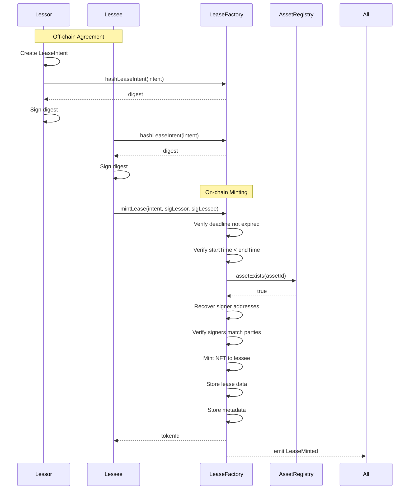
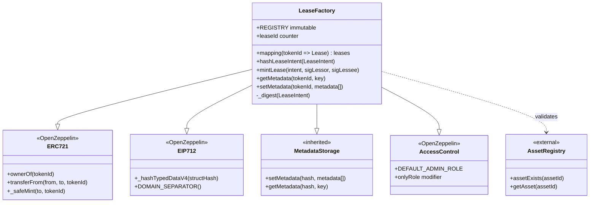
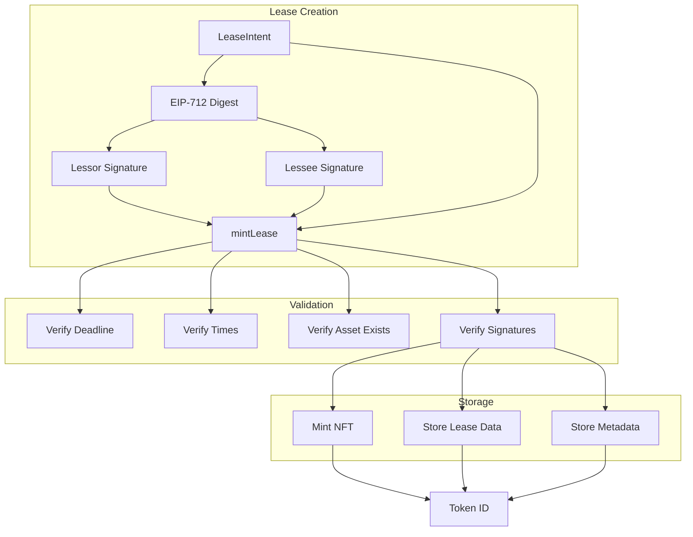

# LeaseFactory

## Overview
The LeaseFactory creates and manages lease agreements as ERC-721 NFTs. It uses EIP-712 typed signatures to ensure both lessor and lessee explicitly consent to lease terms before minting. Each lease NFT represents a binding agreement with on-chain enforcement of terms and metadata storage for additional lease details.

## Key Features
- **ERC-721 Lease NFTs**: Each lease agreement is a unique, transferable NFT owned by the lessee
- **EIP-712 dual signatures**: Requires cryptographic signatures from both parties before minting
- **Structured lease data**: On-chain storage of essential lease parameters (payment, duration, deposit)
- **Metadata inheritance**: Leverages MetadataStorage for flexible lease-specific metadata
- **Asset validation**: Verifies asset existence through AssetRegistry integration
- **Deterministic signing**: Provides helper functions for consistent signature generation
- **Legal document anchoring**: Links to off-chain legal documents via content-addressed hashes

## Architecture
The LeaseFactory serves as:
- The sole minter of lease NFTs in the protocol
- Verifier of dual-party consent through EIP-712 signatures
- Storage for immutable lease terms and mutable metadata
- Integration point with AssetRegistry for asset validation
- Foundation for marketplace lease offers and revenue distribution

## Core Functions

### Signature Helpers

```solidity
function hashLeaseIntent(LeaseIntent calldata L) external view returns (bytes32)
```
Computes the EIP-712 digest for a lease intent. Critical for ensuring off-chain and on-chain signing consistency.

### Lease Creation

```solidity
function mintLease(
    LeaseIntent calldata L,
    bytes calldata sigLessor,
    bytes calldata sigLessee
) external returns (uint256 tokenId)
```
Verifies both signatures, validates lease terms and asset existence, then mints a lease NFT to the lessee. Stores lease data on-chain and metadata in storage.

### View Functions

```solidity
leases(uint256 tokenId) returns (Lease memory)
```
Public mapping to retrieve complete lease data for any token ID.

### Metadata Functions (Token-Specific)

```solidity
function getMetadata(uint256 tokenId, string calldata key) external view returns (string memory)
```
Retrieves metadata for a specific lease token.

```solidity
function setMetadata(uint256 tokenId, Metadata[] calldata metadata_) external onlyRole(DEFAULT_ADMIN_ROLE)
```
Sets metadata for a lease token (admin only).

```solidity
function getAllMetadata(uint256 tokenId) external view returns (Metadata[] memory)
```
Returns all metadata for a lease token.

## Access Control
- **DEFAULT_ADMIN_ROLE**: Can modify lease metadata after minting
- **No special minting role**: Anyone can call mintLease with valid signatures
- **NFT ownership**: Lessee owns the NFT and can transfer it

## Events

```solidity
event LeaseMinted(uint256 indexed tokenId, address indexed lessor, address indexed lessee, uint256 assetId)
```
Emitted when a new lease NFT is successfully minted.

## Data Structures

### LeaseIntent
```solidity
struct LeaseIntent {
    uint64 deadline;              // Signature expiry timestamp
    bytes32 assetTypeSchemaHash;  // Links to asset type for validation
    Lease lease;                  // Actual lease terms
}
```

### Lease
```solidity
struct Lease {
    address lessor;               // Asset owner/lessor
    address lessee;               // Renter (set to bidder in marketplace)
    uint256 assetId;              // Asset being leased (must exist)
    address paymentToken;         // Token for rent payments (usually stablecoin)
    uint256 rentAmount;           // Amount per period
    uint256 rentPeriod;           // Duration of each period in seconds
    uint256 securityDeposit;     // Upfront security deposit
    uint64 startTime;             // Lease start timestamp
    uint64 endTime;               // Lease end timestamp
    bytes32 legalDocHash;         // Hash of signed legal document
    uint16 termsVersion;          // Version for schema evolution
    Metadata[] metadata;          // Additional key-value pairs
}
```

## Usage Examples

### Direct Lease Creation
```solidity
// Lessor and lessee agree on terms off-chain
LeaseIntent memory intent = LeaseIntent({
    deadline: block.timestamp + 1 days,
    assetTypeSchemaHash: satelliteSchemaHash,
    lease: Lease({
        lessor: ownerAddress,
        lessee: renterAddress,
        assetId: 42,
        paymentToken: stablecoinAddress,
        rentAmount: 1000 * 10**6,  // $1000 USDC
        rentPeriod: 30 days,
        securityDeposit: 2000 * 10**6,
        startTime: uint64(block.timestamp),
        endTime: uint64(block.timestamp + 365 days),
        legalDocHash: keccak256(legalDocument),
        termsVersion: 1,
        metadata: metadataArray
    })
});

// Both parties sign the intent digest
bytes32 digest = leaseFactory.hashLeaseIntent(intent);
bytes memory sigLessor = signMessage(digest, lessorPrivateKey);
bytes memory sigLessee = signMessage(digest, lesseePrivateKey);

// Anyone can submit the mint transaction
uint256 tokenId = leaseFactory.mintLease(intent, sigLessor, sigLessee);
```

### Marketplace Integration
```solidity
// Marketplace creates intent with lessee as bidder
LeaseIntent memory marketIntent = intent;
marketIntent.lease.lessee = bidderAddress;

// Marketplace calls mintLease after bid acceptance
uint256 leaseNFT = LEASE_FACTORY.mintLease(marketIntent, lessorSig, bidderSig);
```

### Metadata Management
```solidity
// Add metadata to existing lease
Metadata[] memory updates = new Metadata[](2);
updates[0] = Metadata("inspectionDate", "2024-04-01");
updates[1] = Metadata("maintenanceStatus", "completed");

leaseFactory.setMetadata(tokenId, updates);

// Query lease metadata
string memory status = leaseFactory.getMetadata(tokenId, "maintenanceStatus");
```

## Integration Notes
- **Signature verification**: Uses ECDSA.recover to verify signers match lease parties
- **Asset validation**: Checks AssetRegistry.assetExists() before minting
- **Timestamp validation**: Ensures startTime < endTime and deadline not expired
- **Marketplace flow**: Marketplace sets lessee to bidder address during acceptance
- **Metadata storage**: Uses token ID hash as namespace for metadata isolation
- **NFT transferability**: Lessee can transfer the lease NFT to another party

## Security Considerations
- **Replay protection**: EIP-712 domain separator prevents cross-chain replay attacks
- **Signature expiry**: Deadline parameter prevents old signatures from being used
- **Asset existence check**: Prevents leases for non-existent assets
- **Immutable lease terms**: Core lease data cannot be modified after minting
- **Access-controlled metadata**: Only admin can modify metadata, not lease terms
- **No double-spending**: Each signature combination can only mint one NFT

---

## Diagrams

### Lease Minting Flow


### Contract Structure


### Data Flow
