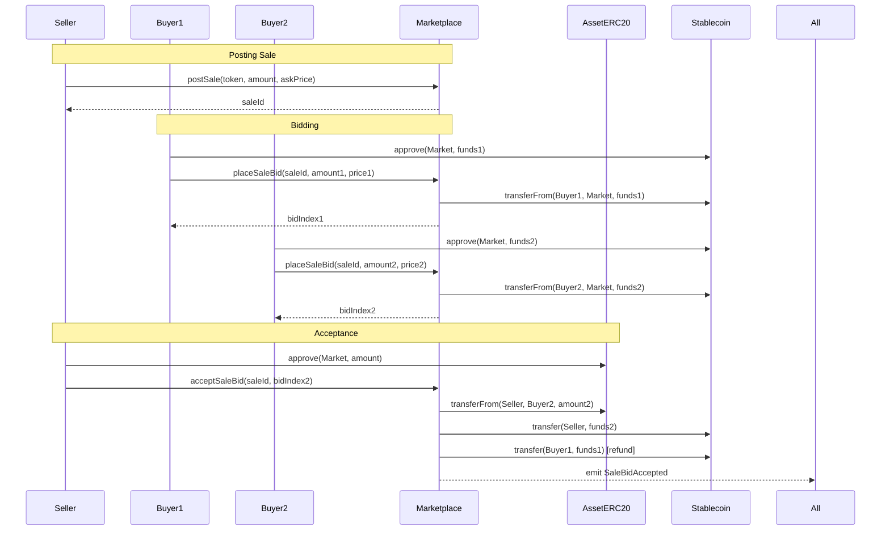
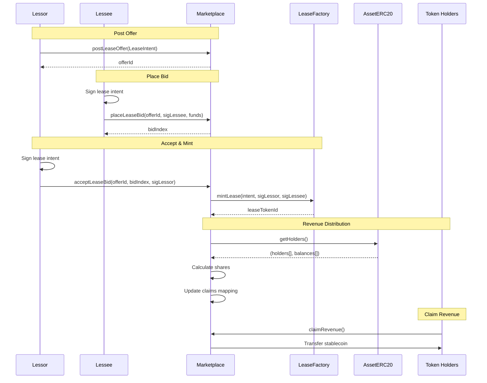
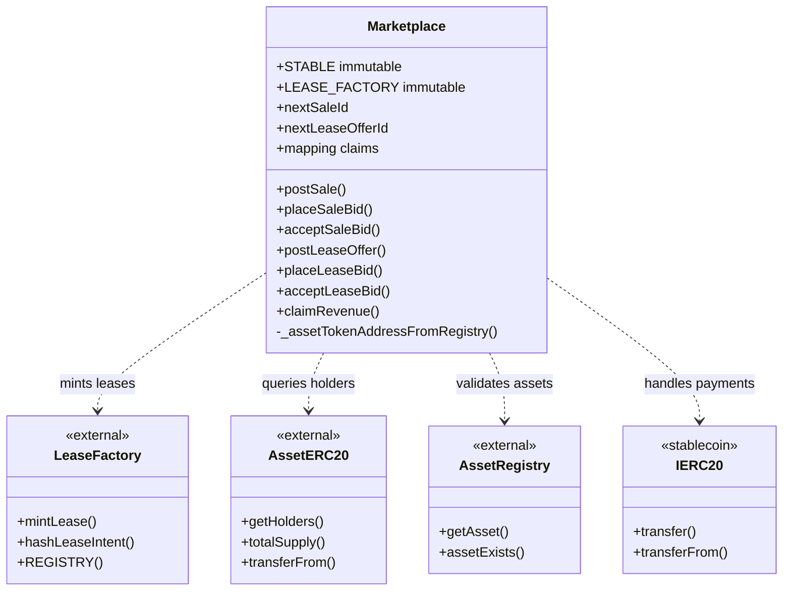

# Marketplace

## Overview
The Marketplace is a decentralized trading platform for asset tokens and lease agreements. It handles two primary functions: facilitating the sale of fractional asset ownership (ERC-20 tokens) and coordinating lease agreement creation with automated revenue distribution to token holders. The contract uses a stablecoin for all financial transactions and implements an escrow-based bidding system.

## Key Features
- **Asset token trading**: Buy and sell whole or fractional ownership via ERC-20 tokens
- **Lease offer marketplace**: Post lease offers and accept funded bids with dual signatures
- **Escrow management**: Secure holding of bid funds until acceptance or refund
- **Revenue distribution**: Automatic pro-rata distribution of lease revenue to token holders
- **Bid competition**: Multiple bidders can compete for sales and leases
- **Atomic settlements**: Token transfers and payments happen in single transactions
- **Claims system**: Accumulated revenue claims for token holders

## Architecture
The Marketplace serves as:
- Trading venue for asset ERC-20 tokens with price discovery
- Coordination layer for lease agreement creation
- Escrow holder for bid funds ensuring payment security
- Revenue distributor calculating and tracking holder shares
- Integration point between LeaseFactory and AssetERC20 contracts

## Upgradeability & Deployment

### UUPS Proxy Pattern
This contract uses the **UUPS (Universal Upgradeable Proxy Standard)** pattern via OpenZeppelin's upgradeable contracts. The contract inherits from `BaseUpgradable` which provides:

- **ERC-1967 Proxy**: Transparent proxy with implementation stored in standardized slot
- **Initializer Pattern**: Constructor logic moved to `initialize()` function
- **Upgrade Authorization**: Only `UPGRADER_ROLE` can authorize upgrades
- **Storage Safety**: Maintains storage layout across upgrades

### Deployment Process

**Step 1: Deploy Implementation**
```solidity
// Deploy the Marketplace implementation contract
Marketplace implementation = new Marketplace();
```

**Step 2: Deploy Proxy**
```solidity
// Deploy ERC1967Proxy pointing to implementation
bytes memory initData = abi.encodeWithSelector(
    Marketplace.initialize.selector,
    admin,                  // Address receiving DEFAULT_ADMIN_ROLE
    upgrader,               // Address receiving UPGRADER_ROLE
    leaseFactoryAddress,    // Address of LeaseFactory contract
    stablecoinAddress       // Address of stablecoin (USDC) contract
);
ERC1967Proxy proxy = new ERC1967Proxy(
    address(implementation),
    initData
);
```

**Step 3: Interact via Proxy**
```solidity
// All interactions go through proxy address
Marketplace marketplace = Marketplace(address(proxy));
```

### Upgrade Process

**Only addresses with `UPGRADER_ROLE` can upgrade:**

```solidity
// Deploy new implementation
MarketplaceV2 newImplementation = new MarketplaceV2();

// Upgrade via proxy (calls _authorizeUpgrade internally)
Marketplace(proxyAddress).upgradeToAndCall(
    address(newImplementation),
    ""  // Optional initialization data
);
```

### View Current Implementation
```solidity
function getUupsImplementation() external view returns (address)
```
Returns the current implementation address for this proxy.

### Upgrade Safety Notes
1. ⚠️ **Storage Layout**: Never reorder, remove, or change types of existing storage variables
2. ⚠️ **Initializers**: New versions must use `reinitializer(2)` if adding initialization logic
3. ⚠️ **Constructor Banned**: Implementation contracts must NOT use constructors
4. ✅ **Testing**: Always test upgrades on testnet before mainnet

## Core Functions

### Sales Management

```solidity
function postSale(
    address assetToken,
    uint256 amount,
    uint256 askPricePerUnit
) external returns (uint256 saleId)
```
Lists asset tokens for sale. The seller retains custody until a bid is accepted.

```solidity
function placeSaleBid(
    uint256 saleId,
    uint256 amount,
    uint256 pricePerUnit
) external returns (uint256 bidIndex)
```
Places a fully-funded bid on a sale. Transfers stablecoin from bidder to escrow.

```solidity
function acceptSaleBid(uint256 saleId, uint256 bidIndex) external
```
Seller accepts a bid. Atomically transfers tokens to bidder, pays seller, and refunds other bidders.

### Lease Management

```solidity
function postLeaseOffer(LeaseIntent calldata L) external returns (uint256 offerId)
```
Posts a lease offer. Must specify the configured stablecoin as payment token.

```solidity
function placeLeaseBid(
    uint256 offerId,
    bytes calldata sigLessee,
    uint256 funds
) external returns (uint256 bidIndex)
```
Places a funded bid with lessee's signature. Escrows the bid amount.

```solidity
function acceptLeaseBid(
    uint256 offerId,
    uint256 bidIndex,
    bytes calldata sigLessor
) external returns (uint256 leaseTokenId)
```
Accepts a lease bid, mints the NFT via LeaseFactory, distributes funds to token holders, and refunds other bidders.

### Revenue Claims

```solidity
function claimRevenue() external
```
Allows token holders to claim their accumulated revenue share from lease payments.

### Upgradeability Functions

```solidity
function getUupsImplementation() external view returns (address)
```
Returns the address of the current implementation contract for this proxy.

## Access Control
- **DEFAULT_ADMIN_ROLE**: General admin capabilities
- **UPGRADER_ROLE**: Can authorize contract upgrades via `upgradeToAndCall()`
- **ADMIN_ROLE**: Administrative functions (currently unused but reserved)
- **No special trading roles**: Anyone can post sales/leases and place bids

## Events

### Sales Events
```solidity
event SalePosted(uint256 indexed saleId, address indexed seller, address assetToken, uint256 amount, uint256 askPricePerUnit)
event SaleBidPlaced(uint256 indexed saleId, uint256 indexed bidIndex, address indexed bidder, uint256 amount, uint256 pricePerUnit, uint256 funds)
event SaleBidAccepted(uint256 indexed saleId, uint256 indexed bidIndex, address bidder)
event SaleBidRefunded(uint256 indexed saleId, uint256 indexed bidIndex, address bidder, uint256 amount)
```

### Lease Events
```solidity
event LeaseOfferPosted(uint256 indexed offerId, address indexed lessor, uint256 assetId)
event LeaseBidPlaced(uint256 indexed offerId, uint256 indexed bidIndex, address indexed bidder, uint256 funds)
event LeaseAccepted(uint256 indexed offerId, uint256 indexed bidIndex, address indexed lessee, uint256 leaseTokenId)
```

### Revenue Events
```solidity
event RevenueClaimed(address indexed account, uint256 share)
```

## Data Structures

### Sale
```solidity
struct Sale {
    address seller;
    address assetToken;
    uint256 amount;
    uint256 askPricePerUnit;  // Informational in v1
    bool active;
}
```

### SaleBid
```solidity
struct SaleBid {
    address bidder;
    uint256 amount;
    uint256 pricePerUnit;
    uint256 funds;           // Escrowed amount (amount * pricePerUnit / 1e18)
    bool active;
}
```

### LeaseOffer
```solidity
struct LeaseOffer {
    address lessor;
    LeaseFactory.LeaseIntent terms;
    bool active;
}
```

### LeaseBid
```solidity
struct LeaseBid {
    address bidder;
    bytes sigLessee;         // Bidder's signature on lease terms
    uint256 funds;           // Escrowed payment
    bool active;
}
```

## Usage Examples

### Asset Token Trading
```solidity
// Seller posts 1000 tokens for sale
uint256 saleId = marketplace.postSale(
    assetTokenAddress,
    1000 * 10**18,
    500 * 10**6  // $500 USDC per token (informational)
);

// Buyer places bid for 500 tokens at $450 each
STABLE.approve(marketplace, 225000 * 10**6);
uint256 bidIndex = marketplace.placeSaleBid(
    saleId,
    500 * 10**18,    // 500 tokens
    450 * 10**6       // $450 USDC per token
);

// Seller accepts the bid
assetToken.approve(marketplace, 500 * 10**18);
marketplace.acceptSaleBid(saleId, bidIndex);
// Result: Buyer receives tokens, seller receives payment, other bids refunded
```

### Lease Creation with Revenue Distribution
```solidity
// Lessor posts lease offer
LeaseFactory.LeaseIntent memory intent = LeaseFactory.LeaseIntent({
    deadline: block.timestamp + 7 days,
    assetTypeSchemaHash: schemaHash,
    lease: LeaseFactory.Lease({
        lessor: lessorAddress,
        lessee: address(0),  // Open to any lessee
        assetId: 42,
        paymentToken: address(STABLE),
        rentAmount: 10000 * 10**6,  // $10,000 USDC
        // ... other lease terms
    })
});

uint256 offerId = marketplace.postLeaseOffer(intent);

// Lessee places funded bid with signature
bytes32 digest = leaseFactory.hashLeaseIntent(intent);
bytes memory sigLessee = signMessage(digest, lesseePrivateKey);

STABLE.approve(marketplace, 10000 * 10**6);
uint256 bidIndex = marketplace.placeLeaseBid(offerId, sigLessee, 10000 * 10**6);

// Lessor accepts bid with their signature
bytes memory sigLessor = signMessage(digest, lessorPrivateKey);
uint256 leaseNFT = marketplace.acceptLeaseBid(offerId, bidIndex, sigLessor);

// Revenue is automatically distributed to token holders based on ownership %
// Token holders can claim their share
marketplace.claimRevenue();
```

### Revenue Distribution Calculation
```solidity
// Internal logic during lease acceptance
AssetERC20 asset = AssetERC20(assetTokenAddress);
(address[] memory holders, uint256[] memory balances) = asset.getHolders();
uint256 totalSupply = asset.totalSupply();

// Calculate and record claims for each holder
for (uint256 i = 0; i < holders.length; i++) {
    uint256 share = (bidFunds * balances[i]) / totalSupply;
    claims[holders[i]] += share;
}
```

## Integration Notes
- **Stablecoin requirement**: All payments use the configured stablecoin (USDC in production)
- **Price calculation**: Token prices use 18 decimals, stablecoin uses 6 decimals
- **Atomic operations**: Transfers and payments happen in single transaction
- **Refund mechanism**: Non-winning bids automatically refunded on acceptance
- **LeaseFactory integration**: Marketplace calls mintLease with collected signatures
- **Holder enumeration**: Relies on AssetERC20.getHolders() for revenue distribution

## Security Considerations
- **Escrow protection**: Bid funds held in contract until acceptance or refund
- **Approval requirements**: Sellers must approve token transfers before acceptance
- **Signature validation**: Lease signatures verified by LeaseFactory
- **Reentrancy protection**: State changes before external calls
- **Integer overflow**: Uses Solidity 0.8+ automatic overflow protection
- **Access control**: Only sellers/lessors can accept their own offers

---

## Diagrams

### Sale Flow


### Lease with Revenue Distribution


### Contract Architecture
