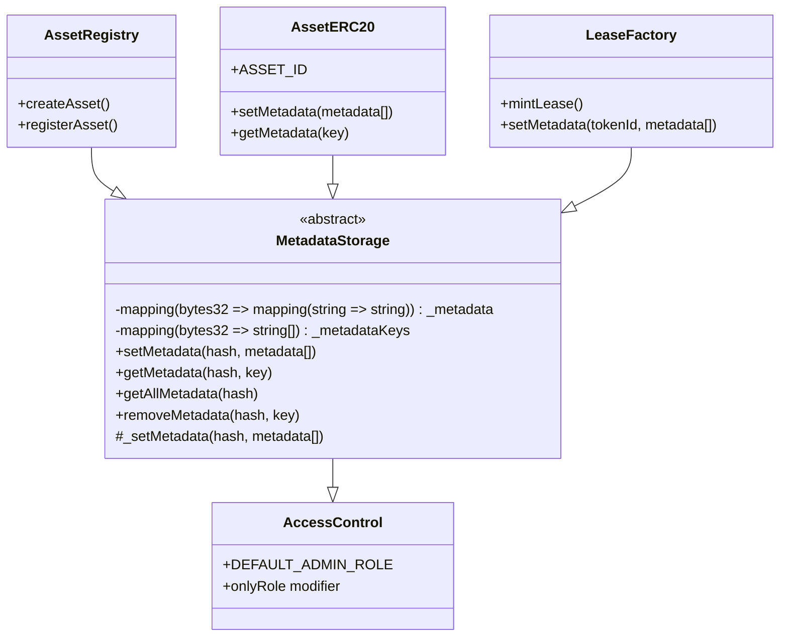
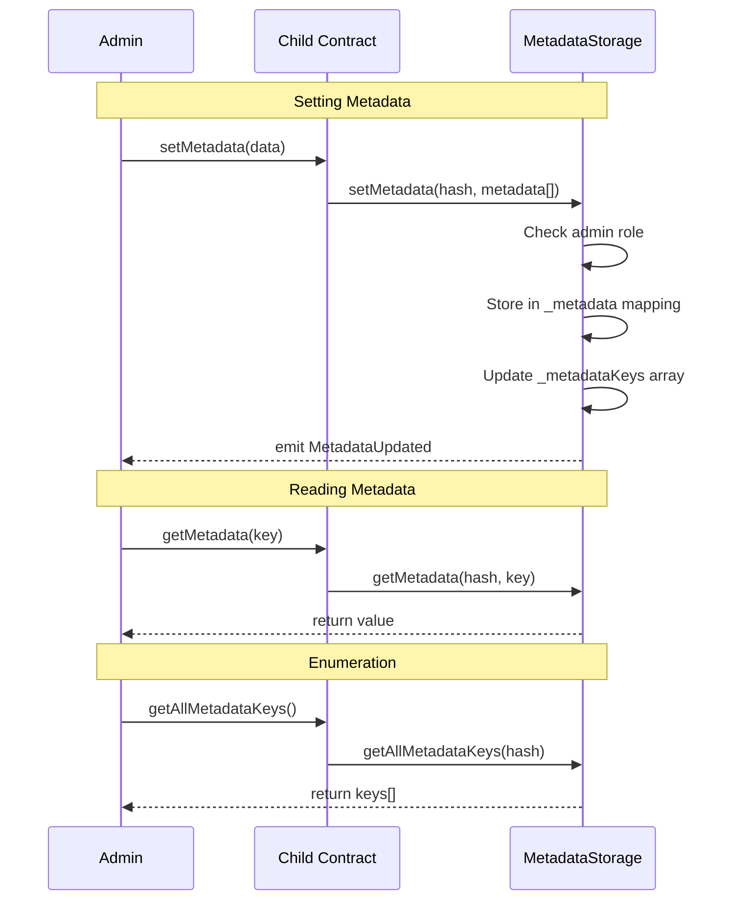

# MetadataStorage

## Overview
MetadataStorage is an abstract base contract that provides flexible, unstructured on-chain metadata storage functionality. It serves as the foundation for key-value metadata management across the protocol, with namespace isolation through hash-based scoping.

## Key Features
- **Hash-based namespacing**: Metadata is isolated by `bytes32` hash values, preventing collisions
- **Key-value storage**: Flexible string key-value pairs for arbitrary metadata
- **Enumeration support**: Track and retrieve all keys for a given namespace
- **Access control**: Admin-only public functions with internal helpers for constructors
- **Dual-layer API**: Public access-controlled functions and internal unrestricted functions

## Architecture
MetadataStorage is inherited by three core protocol contracts:
- **AssetRegistry**: Uses schema hashes as namespaces for asset type metadata
- **AssetERC20**: Uses asset ID hashes as namespaces for asset instance metadata
- **LeaseFactory**: Uses lease token ID hashes as namespaces for lease agreement metadata

The contract provides a clean separation between storage logic and business logic, allowing child contracts to focus on their specific functionality while leveraging common metadata patterns.

## Core Functions

### Setting Metadata

```solidity
function setMetadata(bytes32 hash, Metadata[] memory metadata_) public onlyRole(DEFAULT_ADMIN_ROLE)
```
Sets multiple metadata key-value pairs for a specific hash namespace. Requires admin role.

```solidity
function _setMetadata(bytes32 hash, Metadata[] memory metadata_) internal
```
Internal function for setting metadata without access control. Critical for constructor initialization where the caller (factory contract) may not have admin role yet.

### Reading Metadata

```solidity
function getMetadata(bytes32 hash, string memory key) public view returns (string memory value)
```
Retrieves a single metadata value by key within a namespace.

```solidity
function getAllMetadata(bytes32 hash) public view returns (Metadata[] memory metadata)
```
Returns all metadata key-value pairs for a namespace as an array.

```solidity
function getAllMetadataKeys(bytes32 hash) public view returns (string[] memory keys)
```
Returns an array of all keys that have been set for a namespace.

### Managing Metadata

```solidity
function removeMetadata(bytes32 hash, string calldata key) public onlyRole(DEFAULT_ADMIN_ROLE)
```
Removes a metadata entry and updates the keys array. Requires admin role.

```solidity
function hasMetadata(bytes32 hash, string calldata key) public view returns (bool exists)
```
Checks if a metadata key exists in a namespace.

```solidity
function getMetadataCount(bytes32 hash) public view returns (uint256 count)
```
Returns the total number of metadata entries for a namespace.

## Access Control
- **DEFAULT_ADMIN_ROLE**: Required for public setMetadata and removeMetadata functions
- **Internal functions**: `_setMetadata` bypasses access control for constructor usage
- **Inheritance pattern**: Child contracts can add their own access control layers

## Events

```solidity
event MetadataUpdated(bytes32 indexed hash, string key, string value)
```
Emitted when metadata is added or updated.

```solidity
event MetadataRemoved(bytes32 indexed hash, string key)
```
Emitted when a metadata key is removed from a namespace.

## Usage Examples

### In AssetRegistry
```solidity
// Creating an asset type with metadata
function createAsset(
    string calldata name,
    bytes32 schemaHash,
    bytes32[] calldata requiredLeaseKeys,
    Metadata[] calldata metadata
) external onlyRole(DEFAULT_ADMIN_ROLE) {
    _assetTypes[schemaHash] = AssetType(name, requiredLeaseKeys);
    // Store metadata using schema hash as namespace
    setMetadata(schemaHash, metadata);
}
```

### In AssetERC20 Constructor
```solidity
constructor(..., Metadata[] memory metadata) {
    // Use internal _setMetadata to bypass access control during construction
    _setMetadata(keccak256(abi.encodePacked(ASSET_ID)), metadata);
}
```

### In LeaseFactory
```solidity
// Storing lease metadata when minting
function mintLease(LeaseIntent calldata L, ...) external {
    // ... verification logic ...
    leases[tokenId] = L.lease;
    // Store metadata using token ID hash as namespace
    setMetadata(keccak256(abi.encodePacked(tokenId)), L.lease.metadata);
}
```

## Integration Notes
- **Namespace design**: Always use deterministic hashes (e.g., keccak256 of IDs) to ensure consistent namespacing
- **Constructor pattern**: Use `_setMetadata` in constructors to avoid access control issues during deployment
- **Child contract overrides**: Implementing contracts often provide simplified interfaces that abstract the hash parameter
- **Gas optimization**: Batch metadata updates when possible using the array parameter

## Security Considerations
- **Access control split**: The dual-layer API (public with access control, internal without) enables secure initialization while maintaining runtime security
- **Key collision prevention**: Hash-based namespacing ensures different entities cannot accidentally overwrite each other's metadata
- **Enumeration safety**: Keys array management ensures consistency between storage and enumeration
- **Input validation**: Empty keys are prevented through storage checks
- **Admin trust**: Admin role can modify any metadata - ensure proper role management in production

---

## Diagrams

### Inheritance Structure


### Metadata Flow
