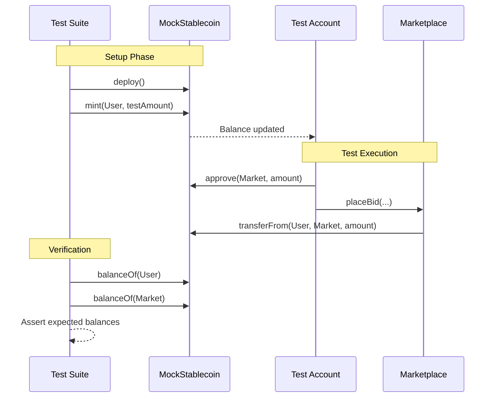
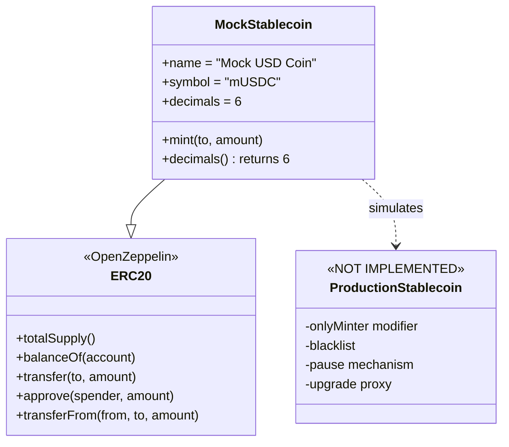
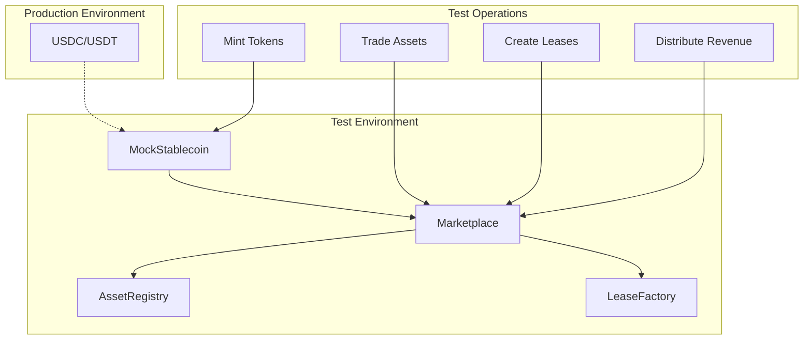

# MockStablecoin

**⚠️ TEST UTILITY ONLY - NOT FOR PRODUCTION USE**

## Overview
MockStablecoin is a simplified ERC-20 token contract designed exclusively for testing and development purposes. It simulates a USDC-like stablecoin with 6 decimal places and includes a public mint function for easy test funding. This contract is deployed only in test environments (local, testnet) and should never be used in production.

## Key Features
- **6 decimal places**: Matches USDC/USDT decimal convention
- **Public minting**: Anyone can mint tokens for testing (faucet functionality)
- **Standard ERC-20**: Inherits all standard transfer and allowance functions
- **No access control**: Intentionally permissionless for testing convenience
- **Simple implementation**: Minimal code for easy debugging and verification

## Architecture
MockStablecoin serves as:
- Payment token for all marketplace transactions in tests
- Escrow currency for bids and revenue distribution
- Stand-in for production stablecoins (USDC, USDT, etc.)
- Test funding mechanism via unlimited minting

## Core Functions

```solidity
function mint(address to, uint256 amount) external
```
Mints tokens to any address. This faucet-style function allows test accounts to obtain stablecoins for testing marketplace operations, lease payments, and revenue distributions.

```solidity
function decimals() public pure returns (uint8)
```
Returns 6, matching the decimal convention of major stablecoins like USDC and USDT. This ensures test calculations match production behavior.

## Inherited ERC-20 Functions
- `transfer(address to, uint256 amount)`
- `approve(address spender, uint256 amount)`
- `transferFrom(address from, address to, uint256 amount)`
- `balanceOf(address account)`
- `totalSupply()`
- `allowance(address owner, address spender)`

## Usage Examples

### Test Setup
```solidity
// Deploy mock stablecoin in test
MockStablecoin stable = new MockStablecoin();

// Fund test accounts
stable.mint(alice, 1_000_000 * 10**6);  // $1M USDC
stable.mint(bob, 500_000 * 10**6);      // $500K USDC
stable.mint(charlie, 250_000 * 10**6);  // $250K USDC
```

### Marketplace Testing
```solidity
// Alice approves marketplace for bid
stable.approve(address(marketplace), 10_000 * 10**6);

// Place bid on asset sale
marketplace.placeSaleBid(saleId, amount, pricePerUnit);

// Verify escrow transfer
assertEq(stable.balanceOf(address(marketplace)), 10_000 * 10**6);
```

### Revenue Distribution Testing
```solidity
// Mint revenue to marketplace for distribution
stable.mint(address(marketplace), revenueAmount);

// Token holders claim their shares
vm.prank(holder1);
marketplace.claimRevenue();

// Verify payout
assertEq(stable.balanceOf(holder1), expectedShare);
```

## Integration Notes
- **Test-only deployment**: Never deploy to mainnet or production environments
- **Decimal handling**: Always use 10**6 for dollar amounts (e.g., $100 = 100 * 10**6)
- **Unlimited supply**: No cap on minting, enabling any test scenario
- **No oracle**: Fixed 1:1 USD value assumption in tests
- **Gas costs**: Simplified implementation may not reflect production gas usage

## Security Considerations
- **NO PRODUCTION USE**: Public mint function makes this unsuitable for any real value
- **Test isolation**: Each test should start with fresh balances to avoid contamination
- **Approval management**: Tests should reset approvals between scenarios
- **Reentrancy**: No guards needed as this is test-only
- **Access control**: Intentionally absent for testing flexibility

## Testing Best Practices
1. **Reset balances**: Start each test with known balances
2. **Explicit amounts**: Use clear variable names for amounts (e.g., `oneThousandUSDC`)
3. **Verify transfers**: Always check balances after transfers in tests
4. **Test edge cases**: Use the mint function to test with extreme values
5. **Mock production**: Match production decimal handling despite unlimited minting

---

## Diagrams

### Test Flow


### Contract Structure


### Usage in Protocol Tests
