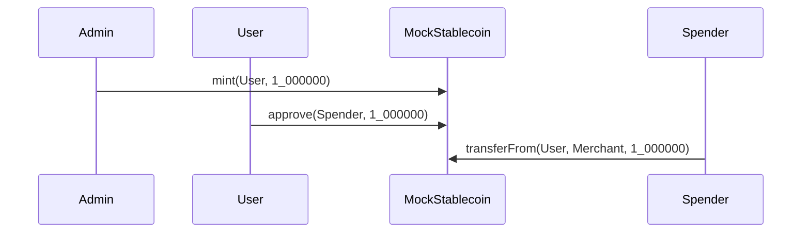
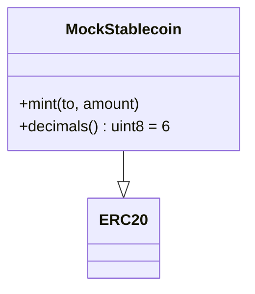

# MockStablecoin

## Purpose
MockStablecoin is a simple ERC-20 with 6 decimals, used in testing to simulate a stablecoin like USDC.

## Key Concepts
- Faucet minting for tests.
- Inherits all standard ERC-20 transfer and allowance functions.

## Functions
- `mint(to, amount)`  
  Faucet-style function to mint tokens for testing.

- `decimals()`  
  Returns 6, so balances are interpreted as USDC-style.

## Workflow
1. Tests call `mint` to fund accounts with mock stablecoins.
2. Contracts use this token for escrow, payments, and revenue sharing in place of real stablecoins.

---

## Diagrams

### Mint & Transfer (sequence)

### Token Class (class)

