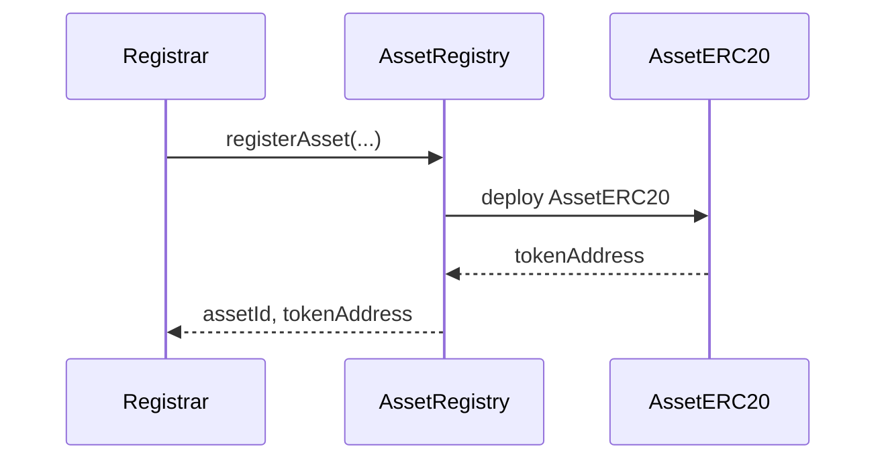
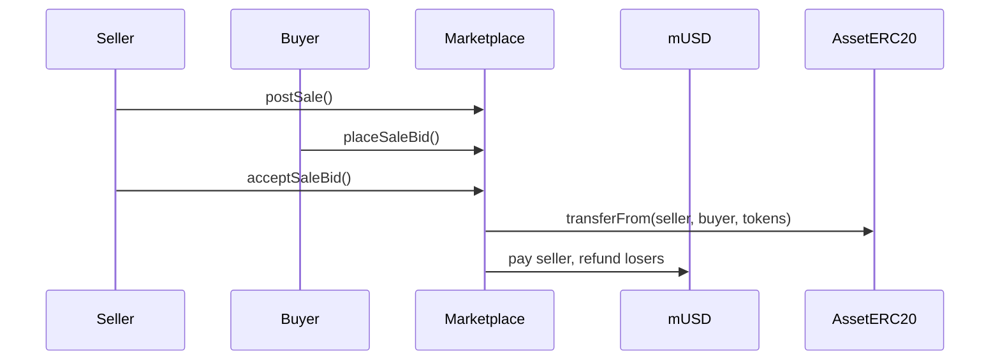
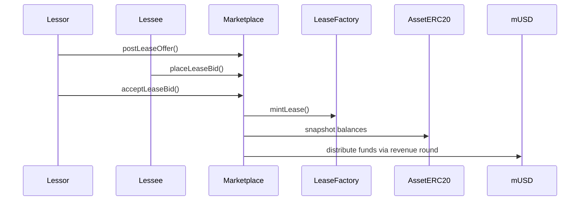
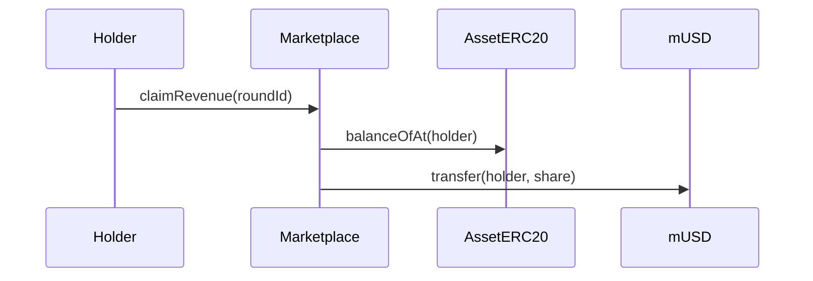

# Technical Walkthrough

This document explains the code architecture, file structure, Ethereum standards used, code patterns, OpenZeppelin libraries, and a function-by-function map (with short descriptions). It ends with workflow diagrams showing how the system operates end-to-end.

---

## Codebase Overview

### File Structure (top-level)

```
/src
  /interfaces
    IAssetRegistry.sol
  AssetRegistry.sol
  AssetERC20.sol
  LeaseFactory.sol
  Marketplace.sol

/test
  /mocks
    MockStablecoin.sol
  AssetFlow.t.sol
  MarketplaceFlow.t.sol

/docs
  README.md
  technical-walkthrough.md
```

### Key Contracts

- **AssetRegistry** — Registers asset types and assets, deploys an ERC-20 per asset, anchors schema and metadata hashes.
- **AssetERC20** — One ERC-20 per asset; entire supply minted to the initial owner; supports snapshots for revenue sharing.
- **LeaseFactory** — Mints ERC-721 “Lease” NFTs using dual EIP-712 signatures (lessor + lessee); stores minimal on-chain lease payload.
- **Marketplace** — Lists sales (whole/fractional ERC-20) and lease offers; requires **funded** bids; handles accepts, refunds, and lease revenue distribution via snapshots.
- **MockStablecoin** — Minimal ERC-20 with 6 decimals and a faucet `mint` for testing.

---

## Ethereum Standards & Libraries

- **ERC-20 (OpenZeppelin)** — Asset ownership and fractionalization via per-asset ERC-20 contracts.
- **ERC-721 (OpenZeppelin)** — Lease NFTs (proof of a signed lease).
- **EIP-712 (OpenZeppelin `EIP712` + `ECDSA`)** — Typed data signatures for lease intents.
- **ERC-20 Snapshot (OpenZeppelin `ERC20Snapshot`)** — Point-in-time balances for fair revenue sharing.
- **AccessControl (OpenZeppelin)** — Roles for admin/registrar/snapshot/minter.
- **OpenZeppelin v5 patterns** — Internal `_update` override for multiple inheritance with snapshots.

---

## Function Map

(see previous answer — listing all functions with descriptions)

---

## Diagrams

### Architecture

```mermaid
flowchart LR
  subgraph Registry Layer
    R[AssetRegistry]
  end

  subgraph Asset Tokens
    T1[AssetERC20 (per asset)]
  end

  subgraph Leasing
    L[LeaseFactory (ERC-721)]
  end

  subgraph Market
    M[Marketplace]
    S[mUSD (MockStablecoin)]
  end

  U[Users / Wallets]

  U -->|register via registrar| R
  R -->|deploy| T1
  U -->|transfer fractions| T1
  U -->|post sales & lease offers| M
  M -->|escrow stablecoin| S
  M -->|mint lease via signatures| L
  M -->|snapshot + revenue rounds| T1
  U -->|claim revenue| M
```

### Asset Registration



### Sale Flow



### Lease Flow



### Revenue Claim


